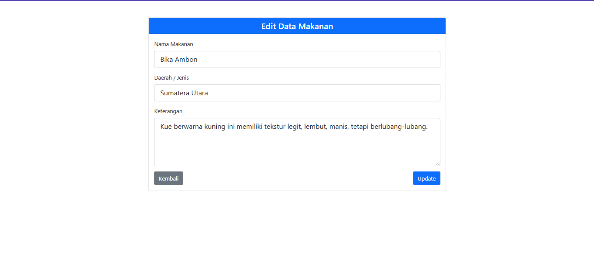

# Project UAS

## Profil
| Variable | Isi |
| -------- | --- |
| **Nama** |Bayu Aji Yuwono|
| **NIM** | 312310492 |
| **Kelas** | TI.23.A.5 |
| **Mata Kuliah** | Pemrograman Web 1 |

# **f-Bay Kuliner**

# 🌟 f-Bay Kuliner 🌟

f-Bay Kuliner adalah sebuah aplikasi web sederhana yang bertujuan untuk memperkenalkan dan mengelola informasi tentang makanan serta minuman khas dari berbagai daerah di Indonesia. Dengan aplikasi ini, pengguna dapat menelusuri, menambahkan, mengedit, atau menghapus informasi makanan/minuman tradisional, serta memahami lebih dalam tentang keberagaman kuliner Nusantara.

---

## 🎯 Fitur Utama

1. **Daftar Makanan dan Minuman**  
   Aplikasi menampilkan daftar makanan dan minuman khas dari berbagai daerah di Indonesia. Setiap item yang ditampilkan mencakup informasi berikut:
   - **Nama**: Nama makanan atau minuman khas daerah.  
   - **Daerah Asal**: Lokasi asal makanan/minuman tersebut.  
   - **Deskripsi**: Informasi singkat tentang makanan/minuman, mencakup cita rasa, tekstur, atau proses pembuatannya.  

2. **Tambah (Add) Makanan dan Minuman**  
   Pengguna dapat menambahkan makanan atau minuman baru ke dalam daftar dengan fitur ini. Informasi yang perlu diisi antara lain:  
   - Nama makanan/minuman.  
   - Daerah asal.  
   - Deskripsi singkat.  
   - Gambar (opsional).  

3. **Edit Informasi Makanan/Minuman**  
   Pengguna dapat memperbarui informasi makanan/minuman jika ada perubahan data. Klik tombol **Edit** untuk memulai proses.

4. **Hapus Data Makanan/Minuman**  
   Pengguna dapat menghapus item dari daftar dengan mengklik tombol **Hapus**.

5. **Halaman About**  
   Halaman ini menyediakan informasi tentang tujuan aplikasi, tim pengembang, dan misi utama dari f-Bay Kuliner. Halaman ini dirancang untuk memberikan gambaran singkat mengenai aplikasi kepada pengguna.

6. **Tampilan Responsif**  
   Antarmuka aplikasi dirancang agar kompatibel dengan berbagai perangkat, mulai dari desktop hingga smartphone.

---

## 🛠️ Teknologi yang Digunakan

- **Frontend**: HTML, CSS, dan JavaScript untuk membangun antarmuka pengguna yang menarik.  
- **Backend**: Framework backend seperti Node.js, Laravel, atau Django (sesuaikan sesuai kebutuhan).  
- **Database**: Digunakan untuk menyimpan data makanan dan minuman, seperti MySQL, MongoDB, atau lainnya.  
- **Framework UI**: Jika menggunakan Bootstrap atau Tailwind CSS, sebutkan di sini.  

---

## 📖 Cara Menggunakan Aplikasi

1. **Menambahkan Makanan/Minuman**  
   - Klik tombol "Add" pada halaman utama.  
   - Isi formulir dengan detail makanan/minuman yang ingin ditambahkan, termasuk nama, daerah asal, dan deskripsi.  
   - Klik tombol "Simpan" untuk menyimpan data.  

2. **Melihat Detail Makanan/Minuman**  
   - Klik pada salah satu item di daftar untuk melihat deskripsi lengkapnya.  

3. **Mengedit Informasi**  
   - Klik tombol "Edit" pada item makanan/minuman yang ingin diperbarui.  
   - Perbarui informasi sesuai kebutuhan dan klik "Simpan".  

4. **Menghapus Data**  
   - Klik tombol "Hapus" pada item makanan/minuman yang ingin dihapus.  
   - Konfirmasi penghapusan untuk menyelesaikan proses.  

5. **Mengakses Halaman About**  
   - Klik tombol **About** di pojok kanan atas aplikasi untuk melihat informasi tentang aplikasi ini.  

---

