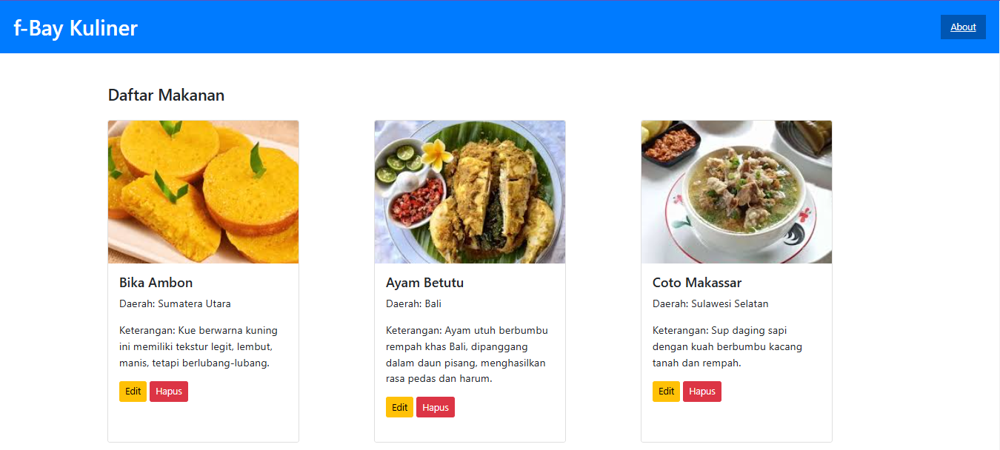

# Project UAS

## Profil
| Variable | Isi |
| -------- | --- |
| **Nama** |Bayu Aji Yuwono|
| **NIM** | 312310492 |
| **Kelas** | TI.23.A.5 |
| **Mata Kuliah** | Pemrograman Web 1 |

# **f-Bay Kuliner**

f-Bay Kuliner adalah sebuah aplikasi web sederhana yang digunakan untuk menampilkan daftar makanan dan minuman tradisional dari berbagai daerah di Indonesia. Pengguna dapat melihat deskripsi singkat mengenai makanan dan minuman, serta memiliki opsi untuk mengedit atau menghapus informasi makanan.

**Fitur Utama**
1. Daftar Makanan dan Minuman
   Menampilkan daftar makanan dan minuman tradisional dengan detail:

     • Nama makanan dan minuman : Nama makanan dan minuman khas daerah.
  
     • Daerah asal: Lokasi asal makanan.
  
     • Deskripsi makanan dan minuman : Penjelasan singkat tentang makanan dan minuman, termasuk rasa, tekstur, dan cara penyajian.
  
     • Opsi Edit dan Hapus

2. Opsi Edit dan Hapus

     • Edit: Memungkinkan pengguna untuk memperbarui informasi terkait makanan dan minumanan.

     • Hapus: Menghapus makanan dan minuman dari daftar.
